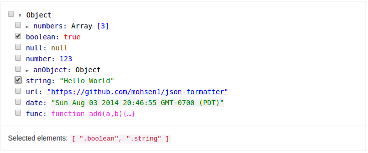

# Angular Directive for JSON Formatter with selectable items
[](https://travis-ci.org/31piy/json-formatter)
[](https://codeclimate.com/github/31piy/json-formatter)

This is a forked repo from https://github.com/mohsen1/json-formatter. Please visit the site for more details about JSON formatter.

This refers the core functions from mohsen's JSON formatter and adds the capability to select JSON elements by checkboxes.

[](http://azimi.me/json-formatter/demo/demo.html)

## Usage

* Install via Bower or npm

  ```bash
  bower install json-formatter --save
  ```
  ...or

  ```bash
  npm install jsonformatter --save
  ```
* Add `jsonFormatter` to your app dependencies

  ```js
  angular.module('MyApp', ['jsonFormatter'])
  ```
* Use `<json-formatter>` directive

  ```html
  <json-formatter json="{my: 'json'}" open="1" model="mymodel"></json-formatter>
  ```
* `open` attribute accepts a number which indicates how many levels rendered JSON should be opened
* `model` is an optional attribute to link your model to json formatter. This model should be an array. It will be automatically updated when one more more element(s) are selected/deselected in the JSON.

#### Configuration

You can use `JSONFormatterConfig` provider to configure JOSN Formatter.

Available configurations

##### Hover Preview
* `hoverPreviewEnabled`: enable preview on hover
* `hoverPreviewArrayCount`: number of array items to show in preview Any array larger than this number will be shown as `Array[XXX]` where `XXX` is length of the array.
* `hoverPreviewFieldCount`: number of object properties to show for object preview. Any object with more properties that thin number will be truncated.
* `elementsSelectable`: enables selection of the JSON elements (using checkboxes)

Example using configuration

```js
app.config(function (JSONFormatterConfigProvider) {

  // Enable the hover preview feature
  JSONFormatterConfigProvider.hoverPreviewEnabled = true;
});
```

#### Events
Every selection/deselection of an element fires `element.select` and `element.deselect` events respectively.

If you want, you can use `$jsonFormatter` service to register a listener to these events.

```js
app.controller('MainCtrl', function ($log, $jsonFormatter) {
  // ... your code here

  $jsonFormatter.register(function(event, data) {
    $log.debug("Event: '" + event + "', data: " + JSON.stringify(data));
  });

  // ... your code here

});
```

## Demo
See [Examples here](http://azimi.me/json-formatter/demo/demo.html)


## Known Bugs
##### `hashKey`

If you are iterating in an array of objects using `ng-repeat`, make sure you are using `track by $index` to avoid adding extra `$$hashKey` to your objects.

## Browser Support
All modern browsers are supported. Lowest supported version of Internet Explorer is **IE9**.

## License

Apache 2.0

See [LICENSE](./LICENSE)
